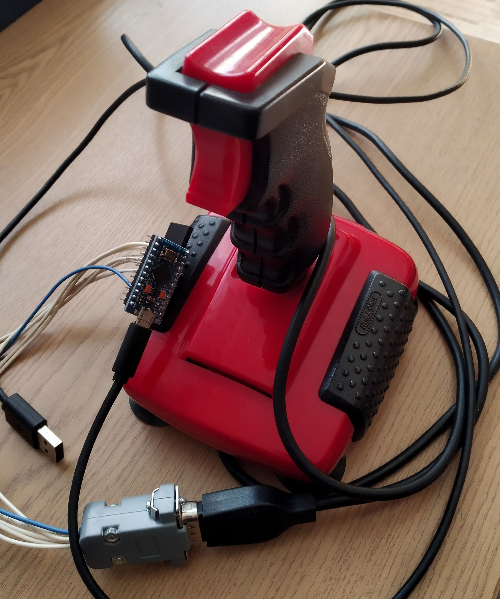

LeoKey

Atari Joystick QuickShot Turbo II to modern PC USB HID Keyboard.

Used a clone of SparkFun Pro Micro.
Pins 4-9 for microswitches on DB-9 INPUT_PULLUP and GND. See [pins](docs/joye.html).

Improvements to other different solutions:

* Amstrad CPC compatibility with two separate Fire triggers
* customizable without Arduino IDE: use Putty to connect to COM port on speed 9600, type anything for a menu, remap
* ascii - just type one letter/number/sign, [special keys](docs/scancodes.csv) - type the name

TODO:
* wizard to remap all keys
* better menu with commands instead of numbers
* diagonals mode to have separate keys attached to all 8 directions
* Fire2 modifier mode - while holding Fire2 has 5 or 9 additional mappings
* save to flash mapping
* on boot depending of what is pressed - fire/direction - select different mapping
* konami code to change mapping on the fly
* try to fix DeviceDruid/SerialUI to work with Leonardo/ProMicro SoftwareSerial
* blink led formapping or mode etc
* XInput

